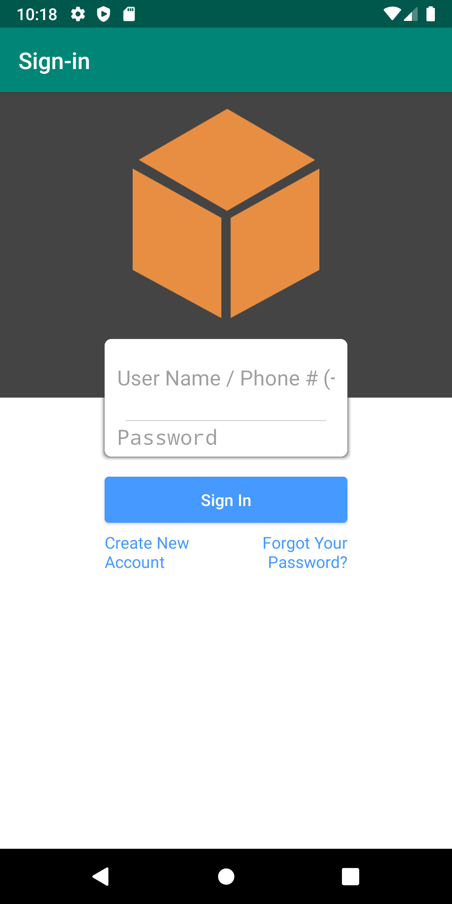

# taskmaster

## Lab 26: Beginning TaskMaster

### Problem Domain

#### Feature Tasks

Today, you’ll start building an Android app that will be a main focus of the second half of the course: TaskMaster. While you’ll start small today, over time this will grow to be a fully-featured application.

* Homepage

    * The main page should be built out to match the wireframe. In particular, it should have a heading at the top of the page, an image to mock the “my tasks” view, and buttons at the bottom of the page to allow going to the “add tasks” and “all tasks” page.

* Add a Task

    * On the “Add a Task” page, allow users to type in details about a new task, specifically a title and a body. When users click the “submit” button, show a “submitted!” label on the page.
    
* All Tasks

    * The all tasks page should just be an image with a back button; it needs no functionality. 
      
##### Daily Change Log

* Added homepage, task page, and all tasks page
* When user clicked on clicks on add task button, the app prompts, "Submitted."

###### Screenshot

###### Homepage

###### Add Task Page

---

## Lab 27: Adding Data to TaskMaster

### Problem Domain

Today, you’ll add the ability to send data among different activities in your application using SharedPreferences and Intents.

#### Feature Tasks

* Task Detail Page

    * Create a Task Detail page. It should have a title at the top of the page, and a Lorem Ipsum description.
    
* Settings Page

    * Create a Settings page. It should allow users to enter their username and hit save.
    
*  Homepage

    * The main page should be modified to contain three different buttons with hardcoded task titles. When a user taps one of the titles, it should go to the Task Detail page, and the title at the top of the page should match the task title that was tapped on the previous page.
      
      The homepage should also contain a button to visit the Settings page, and once the user has entered their username, it should display “{username}’s tasks” above the three task buttons.

##### Daily Change Log

* Added settings page. User now is able to type in their username on the setting page and display the username back to the homepage on top of the task buttons.
* Replaced the image with hardcoded task buttons. When one of the buttons is clicked, the app will take you to the task detail's page.

##### New Homepage

##### Task Details Page

--- 

## Lab 28: RecyclerViews for Displaying Lists of Data

### Problem Domain

Today, you’ll refactor your homepage to look snazzy, with a RecyclerView full of Task data.

#### Feature Tasks

* Task Model

   * Create a Task class. A Task should have a title, a body, and a state. The state should be one of “new”, “assigned”, “in progress”, or “complete”.
    
* Homepage

    * Refactor your homepage to use a RecyclerView for displaying Task data. This should have hardcoded Task data for now.
    
    * Some steps you will likely want to take to accomplish this:
      
        * Create a ViewAdapter class that displays data from a list of Tasks.
        
        * In your MainActivity, create at least three hardcoded Task instances and use those to populate your RecyclerView/ViewAdapter.
        
    
* Ensure that you can tap on any one of the Tasks in the RecyclerView, and it will appropriately launch the detail page with the correct Task title displayed.

##### Daily Change Log

* Added fragment to display hardcoded task in the homepage
* When click on the a task on the RecyclerView, it takes you to task details page where the clicked item is reflected.

##### New Homepage

##### Task Detail

--- 

## Lab: 32 - Room

### Problem Domain

Today, you’ll refactor your model layer to store Task data in a local database.

#### Feature Tasks

* Task Model and Room

    * Following the directions provided in the Android documentation, set up Room in your application, and modify your Task class to be an Entity.

* Add Task Form

    * Modify your Add Task form to save the data entered in as a Task in your local database.
    
* Homepage

    * Refactor your homepage’s RecyclerView to display all Task entities in your database.
    
* Detail Page

    * Ensure that the description and status of a tapped task are also displayed on the detail page, in addition to the title. (Note that you can accomplish this by passing along the entire Task entity, or by passing along only its ID in the intent.)

##### Daily Change Log

* Refactored Task class to setup Room.
* Added ability to add new task and save to database.
* Refactored Homapage to display all Task from database.
* Tapped Task from RecyclerView is displayed in Task Detail Page.

##### New Homepage

##### Task Detail

---

## Lab 33: Polish 

### Problem Domain

Today, your app will add a new activity for all tasks with a Recycler View showing all tasks. These tasks must be clickable. When clicked on, trigger a Toast that displays details about the task.

#### Feature Tasks

* Today, your app will add a new activity for all tasks with a Recycler View showing all tasks. These tasks must be clickable. When clicked on, trigger a Toast that displays details about the task.

##### Daily Change Log

* Added Recycler View in All Task page. Tasks are clickable.
* Toast is triggered when a task is clicked. The toast shows details of the task.

##### All Task

--- 

## Lab: 34 - Amplify and DynamoDB

### Problem Domain

Today, your app will gain a scalable backend by using AWS Amplify. We’ll continue to work with Amplify to add more cloud functionality for the rest of the course.
Setup

#### Feature Tasks

* Tasks Are Cloudy

    * Using the amplify add api command, create a Task resource that replicates our existing Task schema. Update all references to the Task data to instead use AWS Amplify to access your data in DynamoDB instead of in Room.

* Add Task Form

    * Modify your Add Task form to save the data entered in as a Task to DynamoDB.

* Homepage

    * Refactor your homepage’s RecyclerView to display all Task entities in DynamoDB.

##### Daily Change Log

* Modified my app to pull from DynamoDB
* App is now able to add task and save to DynamoDB
* Items from DynamoDB is displayed in RecyclerView

##### Amplify Home Page

---

## Lab: 36 - Cognito 

### Problem Domain

Today, your app will allow users to sign up and log in using Cognito.

#### Feature Tasks

* User Login

    * Add Cognito to your Amplify setup. Add in user login and sign up flows to your application, using Cognito’s pre-built UI as appropriate. Display the logged in user’s username somewhere relevant in your app.

* User Logout

    * Allow users to log out of your application.
      
##### Daily Change Log
* Added Cognito to Amplify.
* User able to login or sign up. Username is displayed in the homepage once the user successfully login.
* User are able to logout.

##### Amplify Home Page

---

## Lab 37: S3 Uploads

### Problem Domain

Today, your app will allow users to upload files related to tasks, like screenshots or log files.
#### Feature Tasks

* Uploads

    * On the “Add a Task” activity, allow users to optionally select a file to attach to that task. If a user attaches a file to a task, that file should be uploaded to S3, and associated with that task.

* Displaying Files

    * On the Task detail activity, if there is a file that is an image associated with a particular Task, that image should be displayed within that activity. (If the file is any other type, you should display a link to it.)

##### Daily Change Log

* Users are able to select file to attach to task then uploaded to S3.
* If an image exist associated with a file, image is displayed in the task detail. If not, a link is displayed.

##### Task Detail
//FIll out later
---

